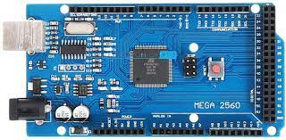
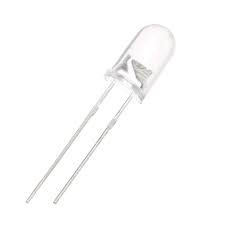
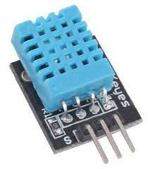
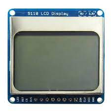

Automatic\_AC\_Temperature\_Regulator\_Using\_Arduino

-----
The aim of this project is to develop a  Prototype Model for controlling the temperature of AC using room temperature and humidity to set an optimum condition.

Libraries used:-

-----
- **SimpleDHT.h**

SimpleDHT sensor library is compatible with multiple low-cost temperatures and humidity sensors like DHT11 and DHT22.

**Including SimpleDHT.h**

- **IRLibSendBase.h**

Part of IRLib Library for Arduino receiving, decoding, and sending infrared signals. 

**Including** **IRLibSendBase.h**

- **IRLib\_HashRaw.h**

Part of IRLib Library for Arduino receiving, decoding, and sending infrared signals. 

**Including IRLib\_HashRaw.h**

- **PCD8544.h**

This is a library for our Monochrome Nokia 5110 LCD Displays. The PCD8544 is a low power CMOS LCD controller/driver, designed to drive a graphic display of 48 rows and 84 columns.

**Including PCD8544.h**

Components used:-

-----
- **Arduino Mega 2560**

The Arduino Mega 2560 is a microcontroller.It has 54 digital input/output pins (of which 15 can be used as PWM outputs), 16 analog inputs, 4 UARTs (hardware serial ports), a 16 MHz crystal oscillator, a USB connection, a power jack, an ICSP header, and a reset button.

- **TSOP1738**

TSOP1738 is an IR receiver with an amplifier that acts as a switch and converter within a circuit. It has one input and output which only acts on the base of the input IR signal.

- **IR LED**

An IR LED (infrared light emitting diode) is a solid state lighting ([SSL](https://www.techtarget.com/whatis/definition/solid-state-lighting-SSL)) device that emits light in the [infrared](https://www.techtarget.com/searchnetworking/definition/infrared-transmission) range of the electromagnetic radiation spectrum.

- **DHT11 sensor**

It is a digital temperature and humidity sensor.

- **LCD Screen**

Used to display the temperature and humidity of the room.

Base Study: -

-----
A cool environment with comfortable temperatures can go a long way in increasing productivity at work places, says a study conducted by the Indian Institute of Management, Ahmedabad. 

The study claims that a worker would be more productive if the temperature of the environment he is working in is pleasant. The study is titled ‘Heat Stress and its effects on psychological aspects of workers’ and claims that people productivity can be enhanced up to 12 per cent by increasing the level of thermal comfort at the workplace. 

It is based on data gathered from 175 workplaces and eight schools all over India.

The professors claimed that air conditioners were not the best solutions for cooling because they often lead to extreme temperatures and can cause drying-up of the skin whereas the optimal temperature range for increased productivity is 25-30 degrees Celsius.Most of the workstations in India function at 35 degrees Celsius which leads to a lot of stress among workers due to high temperatures. But maintaining the optimal temperature will ensure that a person’s psychological well-being is enriched and their level of satisfaction, effort and commitment towards the job goes up. Similarly, in schools and universities also the performance of the students will become better.

